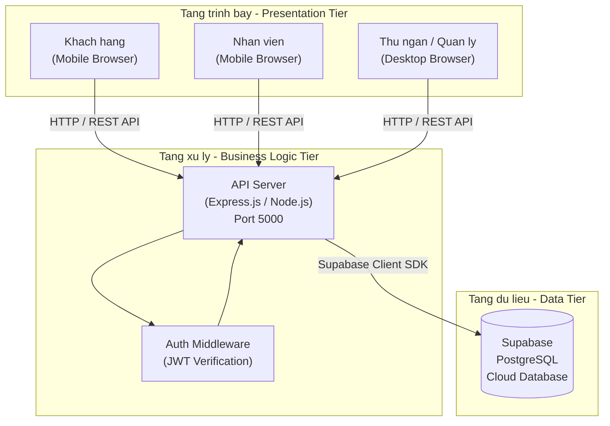
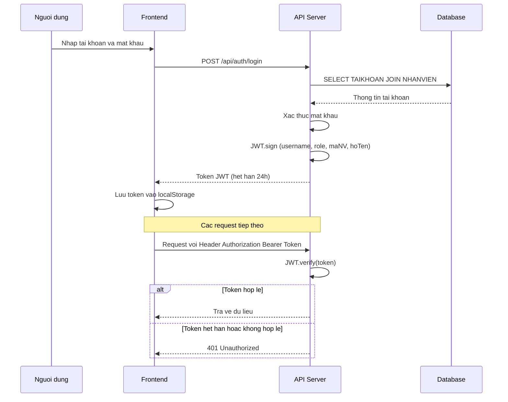
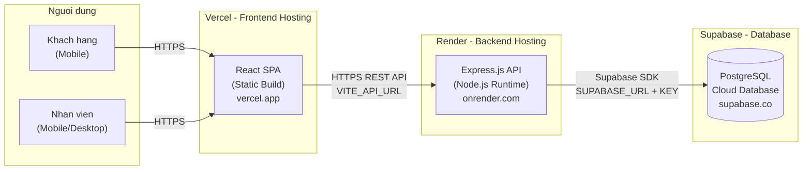

# CHƯƠNG 4: THIẾT KẾ HỆ THỐNG VÀ GIAO DIỆN

> **Đồ án:** Hệ thống quản lý quán cafe Nhà Ba Teria  
> **Phiên bản:** 1.0 | **Ngày tạo:** 17/05/2026

---

## 4.2. Thiết kế kiến trúc hệ thống

### 4.2.1. Kiến trúc tổng quan (Client-Server Architecture)

Hệ thống Nhà Ba Teria được thiết kế theo **kiến trúc 3 tầng (Three-tier Architecture)**, tách biệt rõ ràng giữa tầng trình bày (Presentation), tầng xử lý nghiệp vụ (Business Logic) và tầng dữ liệu (Data).



**Mô tả vai trò từng tầng:**

| Tầng | Vai trò | Công nghệ |
|------|---------|------------|
| **Presentation** | Hiển thị giao diện, tương tác người dùng, gửi/nhận dữ liệu qua API | React 18, Vite, CSS3 |
| **Business Logic** | Xử lý nghiệp vụ, xác thực, phân quyền, điều phối dữ liệu | Express.js, Node.js, JWT |
| **Data** | Lưu trữ, truy vấn dữ liệu quan hệ | Supabase (PostgreSQL) |

---

### 4.2.2. Công nghệ sử dụng

| Thành phần | Công nghệ | Phiên bản | Mục đích |
|------------|-----------|-----------|----------|
| **Frontend Framework** | React | 18.x | Xây dựng giao diện SPA (Single Page Application) |
| **Build Tool** | Vite | 6.x | Biên dịch và đóng gói mã nguồn Frontend |
| **Routing** | React Router DOM | 7.x | Điều hướng các trang trong ứng dụng SPA |
| **Icon Library** | Lucide React | 0.4x | Bộ icon SVG nhất quán, nhẹ |
| **Backend Runtime** | Node.js | 20.x | Môi trường chạy JavaScript phía server |
| **Backend Framework** | Express.js | 4.x | Xây dựng RESTful API |
| **Authentication** | JSON Web Token (JWT) | 9.x | Xác thực và phân quyền người dùng |
| **Database** | PostgreSQL (Supabase) | 15.x | Hệ quản trị CSDL quan hệ trên Cloud |
| **Database SDK** | @supabase/supabase-js | 2.x | Kết nối và truy vấn Supabase từ Backend |
| **CORS** | cors | 2.x | Cho phép giao tiếp cross-origin giữa Frontend và Backend |
| **Env Management** | dotenv | 16.x | Quản lý biến môi trường |

---

### 4.2.3. Thiết kế API RESTful

Hệ thống API được thiết kế theo chuẩn RESTful, phân chia thành **8 module** tương ứng với các nghiệp vụ chính. Tất cả endpoint đều có tiền tố `/api`.

#### a) Module Xác thực (`/api/auth`)

| Method | Endpoint | Mô tả | Quyền truy cập |
|--------|----------|-------|-----------------|
| `POST` | `/api/auth/login` | Đăng nhập, trả về JWT Token | Công khai |
| `GET` | `/api/auth/me` | Lấy thông tin user từ token | Yêu cầu token |

#### b) Module Menu (`/api/menu`)

| Method | Endpoint | Mô tả | Quyền truy cập |
|--------|----------|-------|-----------------|
| `GET` | `/api/menu` | Lấy danh sách menu kèm các món | Công khai |
| `GET` | `/api/menu/items` | Lấy tất cả món (flat list) | Công khai |
| `POST` | `/api/menu/items` | Thêm món mới | `admin` |
| `PUT` | `/api/menu/items/:id` | Cập nhật thông tin món | `admin` |
| `DELETE` | `/api/menu/items/:id` | Xóa món | `admin` |
| `PATCH` | `/api/menu/items/:id/status` | Đổi trạng thái ConMon/HetMon | `admin` |

#### c) Module Giỏ hàng (`/api/cart`)

| Method | Endpoint | Mô tả | Quyền truy cập |
|--------|----------|-------|-----------------|
| `GET` | `/api/cart/:tableId` | Lấy giỏ hàng theo bàn | Công khai |
| `POST` | `/api/cart/:tableId/items` | Thêm món vào giỏ | Công khai |
| `PUT` | `/api/cart/:tableId/items/:itemId` | Cập nhật số lượng/ghi chú | Công khai |
| `DELETE` | `/api/cart/:tableId/items/:itemId` | Xóa món khỏi giỏ | Công khai |

#### d) Module Đơn hàng (`/api/orders`)

| Method | Endpoint | Mô tả | Quyền truy cập |
|--------|----------|-------|-----------------|
| `GET` | `/api/orders` | Lấy danh sách đơn (lọc theo `?status=` hoặc `?table=`) | Công khai |
| `GET` | `/api/orders/:id` | Lấy chi tiết một đơn | Công khai |
| `POST` | `/api/orders` | Tạo đơn hàng từ giỏ hàng | Công khai |
| `PATCH` | `/api/orders/:id/status` | Cập nhật trạng thái đơn hàng | `barista`, `phucvu`, `admin` |
| `DELETE` | `/api/orders/:id` | Xóa đơn hàng | `admin` |

#### e) Module Bàn (`/api/tables`)

| Method | Endpoint | Mô tả | Quyền truy cập |
|--------|----------|-------|-----------------|
| `GET` | `/api/tables` | Lấy danh sách tất cả bàn | Công khai |
| `POST` | `/api/tables` | Thêm bàn mới | `admin` |
| `PUT` | `/api/tables/:id` | Cập nhật thông tin bàn | `admin` |
| `DELETE` | `/api/tables/:id` | Xóa bàn | `admin` |
| `PATCH` | `/api/tables/:id/status` | Cập nhật trạng thái bàn | `admin`, `thungan` |

#### f) Module Hóa đơn (`/api/invoices`)

| Method | Endpoint | Mô tả | Quyền truy cập |
|--------|----------|-------|-----------------|
| `GET` | `/api/invoices` | Lấy danh sách hóa đơn (lọc theo ngày) | `thungan`, `admin` |
| `GET` | `/api/invoices/:id` | Lấy chi tiết hóa đơn | `thungan`, `admin` |
| `POST` | `/api/invoices` | Tạo hóa đơn từ các đơn hàng | `thungan`, `admin` |
| `DELETE` | `/api/invoices/:id` | Xóa hóa đơn | `admin` |

#### g) Module Thanh toán (`/api/payments`)

| Method | Endpoint | Mô tả | Quyền truy cập |
|--------|----------|-------|-----------------|
| `POST` | `/api/payments` | Xác nhận thanh toán cho hóa đơn | `thungan`, `admin` |

#### h) Module Nhân viên (`/api/staff`)

| Method | Endpoint | Mô tả | Quyền truy cập |
|--------|----------|-------|-----------------|
| `GET` | `/api/staff` | Lấy danh sách nhân viên | `admin` |
| `GET` | `/api/staff/:id` | Lấy thông tin chi tiết NV | `admin` |
| `POST` | `/api/staff` | Thêm nhân viên mới (kèm tài khoản) | `admin` |
| `PUT` | `/api/staff/:id` | Cập nhật thông tin nhân viên | `admin` |
| `DELETE` | `/api/staff/:id` | Xóa nhân viên | `admin` |

---

### 4.2.4. Cơ chế xác thực và phân quyền

#### a) Luồng xác thực JWT



#### b) Ma trận phân quyền truy cập

| Module / Tính năng | Khách | Barista | Phục vụ | Thu ngân | Quản lý |
|---------------------|:-----:|:-------:|:-------:|:--------:|:-------:|
| Xem menu, đặt món | ✅ | ❌ | ❌ | ❌ | ❌ |
| Giỏ hàng, gửi đơn | ✅ | ❌ | ❌ | ❌ | ❌ |
| Theo dõi đơn hàng | ✅ | ❌ | ❌ | ❌ | ❌ |
| Xem bảng đơn (Order Board) | ❌ | ✅ | ✅ | ✅ | ✅ |
| Chuyển Chờ → Đang làm | ❌ | ✅ | ❌ | ❌ | ✅ |
| Chuyển Đang làm → Hoàn thành | ❌ | ✅ | ❌ | ❌ | ✅ |
| Chuyển Hoàn thành → Đã giao | ❌ | ❌ | ✅ | ❌ | ✅ |
| Thanh toán, xuất hóa đơn | ❌ | ❌ | ❌ | ✅ | ✅ |
| Quản lý Menu / Bàn / NV | ❌ | ❌ | ❌ | ❌ | ✅ |

#### c) Auth Middleware

Middleware `authMiddleware` được gắn trước các route cần bảo vệ. Nó thực hiện:

1. Trích xuất token từ header `Authorization: Bearer <token>`
2. Giải mã và xác thực token bằng `jwt.verify()`
3. Gắn thông tin user (`req.user`) vào request
4. Kiểm tra `role` nếu route yêu cầu quyền cụ thể

---

### 4.2.5. Cấu trúc thư mục dự án

```
cafe-app/
├── client/                          # Frontend (React + Vite)
│   ├── public/
│   │   └── images/                  # Hình ảnh tĩnh (menu, background)
│   ├── src/
│   │   ├── components/
│   │   │   └── Layout/
│   │   │       ├── DesktopLayout.jsx   # Layout Sidebar cho Desktop
│   │   │       └── DesktopLayout.css
│   │   ├── context/
│   │   │   └── AuthContext.jsx      # Quản lý trạng thái xác thực
│   │   ├── pages/
│   │   │   ├── Customer/            # Giao diện khách hàng
│   │   │   │   ├── CustomerMenu.jsx # Trang đặt món
│   │   │   │   ├── Cart.jsx         # Giỏ hàng
│   │   │   │   └── OrderStatus.jsx  # Theo dõi đơn hàng
│   │   │   ├── Staff/
│   │   │   │   └── OrderBoard.jsx   # Bảng quản lý đơn (Barista/Phục vụ)
│   │   │   ├── Cashier/
│   │   │   │   ├── Payment.jsx      # Trang thanh toán
│   │   │   │   └── InvoiceList.jsx  # Danh sách hóa đơn
│   │   │   ├── Manager/
│   │   │   │   ├── MenuMgmt.jsx     # Quản lý menu & món
│   │   │   │   ├── TableMgmt.jsx    # Quản lý bàn
│   │   │   │   └── StaffMgmt.jsx    # Quản lý nhân viên
│   │   │   └── Login/
│   │   │       └── Login.jsx        # Trang đăng nhập
│   │   ├── services/
│   │   │   └── api.js               # Lớp giao tiếp API (fetch wrapper)
│   │   ├── App.jsx                  # Cấu hình routing & ProtectedRoute
│   │   ├── App.css                  # Style chung cho app
│   │   └── index.css                # CSS variables & design tokens
│   ├── vercel.json                  # Cấu hình deploy Vercel (SPA rewrite)
│   └── vite.config.js
│
├── server/                          # Backend (Express.js)
│   ├── config/
│   │   └── db.js                    # Khởi tạo Supabase Client
│   ├── middleware/
│   │   └── auth.js                  # JWT Auth Middleware
│   ├── routes/
│   │   ├── auth.js                  # /api/auth — Đăng nhập
│   │   ├── menu.js                  # /api/menu — Menu & Món
│   │   ├── cart.js                  # /api/cart — Giỏ hàng
│   │   ├── orders.js                # /api/orders — Đơn hàng
│   │   ├── tables.js                # /api/tables — Bàn
│   │   ├── invoices.js              # /api/invoices — Hóa đơn
│   │   ├── payments.js              # /api/payments — Thanh toán
│   │   └── staff.js                 # /api/staff — Nhân viên
│   ├── server.js                    # Entry point, khởi tạo Express
│   └── .env                         # Biến môi trường
│
└── database/
    └── schema.sql                   # Script khởi tạo CSDL
```

---

### 4.2.6. Thiết kế triển khai (Deployment Architecture)



**Cấu hình biến môi trường:**

| Môi trường | Biến | Mô tả |
|------------|------|-------|
| **Frontend (Vercel)** | `VITE_API_URL` | URL API Backend trên Render (VD: `https://nha-ba-teria-api.onrender.com/api`) |
| **Backend (Render)** | `SUPABASE_URL` | URL project Supabase |
| | `SUPABASE_ANON_KEY` | Public anon key của Supabase |
| | `SUPABASE_SERVICE_ROLE_KEY` | Service role key (quyền admin CSDL) |
| | `JWT_SECRET` | Khóa bí mật để ký và xác thực JWT Token |
| | `PORT` | Cổng chạy server (mặc định: `5000`) |

---

## 4.3. Thiết kế giao diện (Mockup / Prototype)

### 4.3.1. Nguyên tắc thiết kế giao diện

Giao diện hệ thống Nhà Ba Teria được thiết kế tuân theo các nguyên tắc sau:

| Nguyên tắc | Mô tả chi tiết |
|------------|-----------------|
| **Mobile-first** | Ưu tiên thiết kế cho thiết bị di động (tối ưu iPhone 14 Pro Max — 430×932px). Giao diện khách hàng và nhân viên phục vụ/barista được tối ưu hoàn toàn cho màn hình cảm ứng |
| **Responsive Layout** | Giao diện quản lý và thu ngân sử dụng Desktop Layout với Sidebar điều hướng, tự động thích ứng trên nhiều kích thước màn hình |
| **Glassmorphism** | Áp dụng hiệu ứng kính mờ (backdrop-filter blur) cho các thành phần giao diện chính: khung đăng nhập, header, thanh phân loại, thẻ món ăn |
| **Hệ màu chủ đạo** | Tông màu nâu cafe (primary: `#8B4513`), cream (`#FFF8F0`), trắng — tạo cảm giác ấm áp, sang trọng phù hợp với thương hiệu quán cafe |
| **Nhất quán** | Sử dụng hệ thống CSS Variables (Design Tokens) cho toàn bộ màu sắc, spacing, border-radius, shadow, đảm bảo đồng nhất trên mọi trang |
| **Trực quan** | Sử dụng icon từ thư viện Lucide React thay cho text thuần, giúp người dùng thao tác nhanh chóng mà không cần đọc nhiều |

---

### 4.3.2. Nhóm giao diện Khách hàng (Customer — Mobile)

> **Đối tượng sử dụng:** Khách hàng (không cần đăng nhập)  
> **Thiết bị:** Điện thoại di động  
> **Phương thức truy cập:** Quét mã QR trên bàn → Mở trình duyệt → Route `/order/:tableId`

#### MH-01: Trang Đặt món — Tab "Tất cả"

<!-- 📸 CHỤP: Mở trang /order/B01, chọn tab "Tất cả", chụp toàn bộ màn hình hiển thị các nhóm danh mục (Cà phê, Trà,...) với đường phân cách -->

**Mô tả:** Đây là màn hình chính của khách hàng sau khi quét mã QR. Giao diện bao gồm:

- **Header:** Logo "Nhà Ba Teria", nhãn số bàn (VD: "Bàn 01"), nút theo dõi đơn hàng (icon giỏ hàng) ở góc phải. Header sử dụng hiệu ứng glassmorphism với tông nâu trong suốt.
- **Thanh tìm kiếm:** Cho phép tìm kiếm món ăn theo tên. Khi cuộn xuống, thanh tìm kiếm tự động thu gọn thành nút tròn icon kính lúp, nằm cạnh thanh phân loại để tiết kiệm không gian.
- **Thanh phân loại (Category Tabs):** Dạng thanh cuộn ngang gồm các nút: "Tất cả", "Cà phê", "Trà", "Sinh tố", "Nước ép",... Cố định (sticky) ngay dưới header khi cuộn trang.
- **Danh sách món:** Ở tab "Tất cả", các món được nhóm theo danh mục với tiêu đề và đường kẻ phân cách. Mỗi thẻ món hiển thị: hình ảnh, tên món, giá tiền, nút "Thêm".
- **Background:** Hình nền quán cafe được làm mờ (blur 8px) kết hợp overlay trắng trong suốt, tạo chiều sâu cho giao diện.

**Các thành phần tương tác:**
- Bấm nút `+ Thêm` → Thêm món vào giỏ, nút chuyển thành bộ điều khiển số lượng (`-` / số / `+`)
- Bấm icon giỏ hàng trên header → Chuyển đến trang Giỏ hàng hoặc Theo dõi đơn hàng (nếu đã có đơn đang xử lý)

#### MH-02: Trang Đặt món — Tab phân loại cụ thể

<!-- 📸 CHỤP: Chọn tab "Cà phê" hoặc "Trà", chụp màn hình hiển thị chỉ các món thuộc danh mục đã chọn (không có đường phân cách nhóm) -->

**Mô tả:** Khi khách chọn một tab phân loại cụ thể (VD: "Cà phê"), chỉ hiển thị các món thuộc danh mục đó dưới dạng lưới 2 cột, không có đường phân cách nhóm. Tab đang chọn được highlight bằng màu nâu primary.

#### MH-03: Giỏ hàng (Cart)

<!-- 📸 CHỤP: Mở trang /cart/B01 sau khi đã thêm 2-3 món vào giỏ, chụp toàn bộ giao diện giỏ hàng -->

**Mô tả:** Trang giỏ hàng hiển thị danh sách các món đã chọn trước khi gửi đơn. Bao gồm:

- **Header:** Nút quay lại (←), tiêu đề "Giỏ hàng", nhãn bàn
- **Danh sách món trong giỏ:** Mỗi item hiển thị: hình ảnh thu nhỏ (64×64px), tên món, đơn giá, bộ điều khiển số lượng, thành tiền, nút ghi chú (icon bút), nút xóa (icon thùng rác)
- **Thanh tóm tắt (cố định dưới cùng):** Tổng số món, tổng tiền (font lớn, màu accent), nút "Gửi đơn hàng" (full-width, màu primary)

**Các thành phần tương tác:**
- Nút `+`/`-` → Thay đổi số lượng món
- Icon bút chì → Mở ô nhập ghi chú cho từng món (VD: "ít đường", "nhiều đá")
- Icon thùng rác → Xóa món khỏi giỏ
- Nút "Gửi đơn hàng" → Gọi API tạo đơn, chuyển sang trang theo dõi

#### MH-04: Theo dõi đơn hàng (Order Status)

<!-- 📸 CHỤP: Mở trang /order-status/:orderId, chụp giao diện hiển thị thanh tiến độ (progress steps) với trạng thái "Đang làm" -->

**Mô tả:** Sau khi gửi đơn thành công, khách được chuyển đến trang theo dõi trạng thái đơn hàng theo thời gian thực. Bao gồm:

- **Header:** Nút quay lại, tiêu đề "Theo dõi đơn hàng", mã đơn (VD: "DH001"), nút refresh
- **Hero section:** Icon trạng thái lớn (72px) với màu tương ứng, tiêu đề trạng thái (VD: "Đang pha chế"), mô tả phụ
- **Thanh tiến độ (Progress Steps):** 4 bước ngang: Đã đặt → Đang làm → Hoàn thành → Đã giao. Bước hiện tại được phóng to và highlight
- **Chi tiết đơn hàng:** Danh sách món đã đặt kèm số lượng, đơn giá và tổng tiền
- **Auto-refresh:** Trang tự động polling mỗi 5 giây để cập nhật trạng thái mới nhất

#### MH-05: Giỏ hàng trống (Empty Cart)

<!-- 📸 CHỤP: Mở trang /cart/B01 khi chưa thêm món nào, chụp giao diện hiển thị trạng thái trống -->

**Mô tả:** Khi giỏ hàng chưa có món nào, hiển thị trạng thái trống với icon giỏ hàng lớn và thông báo "Giỏ hàng trống", kèm nút quay lại menu để tiếp tục chọn món.

---

### 4.3.3. Giao diện Đăng nhập (Login)

#### MH-06: Màn hình Đăng nhập

<!-- 📸 CHỤP: Mở trang /login, chụp toàn bộ giao diện đăng nhập với background mờ và khung glassmorphism -->

**Mô tả:** Trang đăng nhập dành cho nhân viên và quản lý. Thiết kế nổi bật với:

- **Background:** Hình ảnh quán cafe (`background.jpg`) được làm mờ (blur 10px) phủ toàn màn hình, kết hợp lớp overlay tối (rgba 40%) để tạo chiều sâu
- **Khung đăng nhập (Glassmorphism):** Nền trắng trong suốt 85%, hiệu ứng `backdrop-filter: blur(12px)`, viền sáng nhẹ, bo góc lớn, đổ bóng
- **Logo:** Icon cafe trong hộp gradient nâu (72×72px), tên hệ thống "Nhà Ba Teria", phụ đề "Hệ thống quản lý quán cafe"
- **Form đăng nhập:** Ô nhập Tài khoản, ô nhập Mật khẩu (có nút hiện/ẩn mật khẩu), nút "Đăng nhập" (full-width)
- **Demo accounts:** Khu vực hiển thị các tài khoản demo (admin, thungan, phucvu, barista) dưới dạng badge có thể bấm để tự điền

**Các thành phần tương tác:**
- Bấm badge tài khoản demo → Tự động điền tên đăng nhập và mật khẩu
- Icon mắt → Hiện/ẩn mật khẩu
- Nút "Đăng nhập" → Xác thực và redirect theo vai trò

---

### 4.3.4. Nhóm giao diện Nhân viên (Staff — Mobile)

> **Đối tượng sử dụng:** Barista, Phục vụ  
> **Thiết bị:** Điện thoại di động  
> **Phương thức truy cập:** Đăng nhập → Tự động redirect đến `/staff/orders`

#### MH-07: Bảng đơn hàng — Tab "Chờ"

<!-- 📸 CHỤP: Đăng nhập tài khoản barista, chụp bảng đơn hàng với tab "Chờ" đang active, hiển thị 1-2 đơn hàng -->

**Mô tả:** Màn hình chính của Barista/Phục vụ, hiển thị danh sách đơn hàng theo trạng thái. Bao gồm:

- **Header:** Logo "Nhà Ba Teria", tên nhân viên đang đăng nhập, nút refresh, nút đăng xuất
- **Thanh tab trạng thái:** 4 tab: Chờ (vàng), Đang làm (xanh dương), Hoàn thành (xanh lá), Đã giao (nâu). Mỗi tab hiển thị badge đếm số đơn
- **Danh sách đơn hàng (Card):** Mỗi card gồm: mã đơn, nhãn bàn, thời gian đặt, danh sách món (tên + số lượng), nút hành động ở dưới cùng
- **Nút hành động:** Với tab "Chờ", nút là "Bắt đầu làm" (màu xanh dương) — chỉ hiển thị cho role `barista`

#### MH-08: Bảng đơn hàng — Tab "Đang làm"

<!-- 📸 CHỤP: Vẫn tài khoản barista, chuyển sang tab "Đang làm", chụp hiển thị đơn đang pha chế với nút "Hoàn thành" -->

**Mô tả:** Hiển thị các đơn hàng đang được Barista pha chế. Nút hành động chuyển thành "Hoàn thành" (màu xanh lá). Khi bấm, đơn sẽ chuyển sang tab "Hoàn thành".

#### MH-09: Bảng đơn hàng — Tab "Hoàn thành" (Phục vụ)

<!-- 📸 CHỤP: Đăng nhập tài khoản phucvu, chuyển sang tab "Hoàn thành", chụp hiển thị đơn chờ giao với nút "Đã giao" -->

**Mô tả:** Dành cho Phục vụ — hiển thị các đơn đã pha chế xong, chờ giao cho khách. Nút hành động là "Đã giao" (màu nâu). Khi bấm, đơn chuyển sang trạng thái "Đã giao" và khách hàng sẽ nhận được cập nhật trên trang theo dõi.

---

### 4.3.5. Nhóm giao diện Thu ngân (Cashier — Desktop)

> **Đối tượng sử dụng:** Thu ngân  
> **Thiết bị:** Máy tính Desktop  
> **Phương thức truy cập:** Đăng nhập → Redirect đến `/cashier/payment`  
> **Layout:** Desktop Layout với Sidebar điều hướng bên trái

#### MH-10: Thanh toán — Chọn bàn và xem đơn hàng

<!-- 📸 CHỤP: Đăng nhập tài khoản thungan, mở trang /cashier/payment, chụp toàn bộ giao diện với sidebar bên trái, grid bàn có khách ở giữa, và danh sách đơn hàng bên phải -->

**Mô tả:** Giao diện thanh toán chính của Thu ngân. Bao gồm:

- **Sidebar (bên trái):** Logo, danh sách menu điều hướng (Thanh toán, Hóa đơn, Order Board), thông tin user đang đăng nhập, nút Đăng xuất. Sidebar có thể thu gọn (collapsed) để tăng diện tích hiển thị
- **Khu vực chính:** Lưới bàn (Grid) hiển thị tất cả bàn đang có khách (`TrangThai = DangCoKhach`). Mỗi ô bàn hiển thị tên bàn và số lượng đơn chưa thanh toán
- **Panel chi tiết (khi chọn bàn):** Danh sách đơn hàng của bàn được chọn. Chỉ đơn hàng có trạng thái "Đã giao" (`DaGiao`) mới cho phép tick chọn thanh toán. Các đơn chưa giao hiển thị mờ kèm nhãn trạng thái

#### MH-11: Thanh toán — Xác nhận phương thức thanh toán

<!-- 📸 CHỤP: Sau khi tick chọn đơn DaGiao, chụp phần hiển thị tổng tiền, dropdown phương thức thanh toán (Tiền mặt/Chuyển khoản/Visa), nút "Xác nhận thanh toán" -->

**Mô tả:** Sau khi Thu ngân tick chọn các đơn hàng cần thanh toán:

- Hiển thị tổng tiền cần thanh toán (tính từ chi tiết đơn hàng: SUM(SoLuong × DonGia))
- Dropdown chọn phương thức thanh toán: Tiền mặt, Chuyển khoản, Visa
- Nút "Xác nhận thanh toán" → Tạo hóa đơn (HOADON) → Ghi nhận thanh toán (THANHTOAN) → Kiểm tra nếu bàn không còn đơn chưa thanh toán → Giải phóng bàn về trạng thái "Trống"

#### MH-12: Danh sách Hóa đơn (Invoice List)

<!-- 📸 CHỤP: Chuyển sang trang /cashier/invoices, chụp toàn bộ giao diện danh sách hóa đơn với bộ lọc ngày và bảng dữ liệu -->

**Mô tả:** Trang quản lý danh sách hóa đơn đã xuất. Bao gồm:

- **Bộ lọc:** Chọn ngày để xem hóa đơn theo ngày cụ thể
- **Bảng dữ liệu:** Mã hóa đơn, thời gian xuất, tổng tiền, nhân viên xuất, phương thức thanh toán
- **Thống kê nhanh:** Tổng doanh thu, số hóa đơn trong ngày

---

### 4.3.6. Nhóm giao diện Quản lý (Manager — Desktop)

> **Đối tượng sử dụng:** Quản lý (Admin)  
> **Thiết bị:** Máy tính Desktop  
> **Phương thức truy cập:** Đăng nhập → Redirect đến `/manager/menu`  
> **Layout:** Desktop Layout với Sidebar đầy đủ (6 mục: Quản lý Menu, Quản lý Bàn, Nhân viên, Thanh toán, Hóa đơn, Order Board)

#### MH-13: Quản lý Menu — Danh sách món

<!-- 📸 CHỤP: Đăng nhập admin, mở trang /manager/menu, chụp toàn bộ giao diện với danh sách món dạng bảng/card -->

**Mô tả:** Trang quản lý thực đơn cho phép Admin thêm/sửa/xóa các món. Bao gồm:

- **Thanh công cụ:** Nút "Thêm món mới", ô tìm kiếm, bộ lọc theo danh mục
- **Danh sách món:** Hiển thị dạng bảng với các cột: Hình ảnh, Mã món, Tên món, Danh mục, Đơn giá, Trạng thái (Còn món/Hết món), Hành động (Sửa/Xóa)
- **Toggle trạng thái:** Nút bật/tắt nhanh trạng thái Còn món ↔ Hết món mà không cần mở form sửa

#### MH-14: Quản lý Menu — Modal thêm/sửa món

<!-- 📸 CHỤP: Bấm nút "Thêm món mới" hoặc nút "Sửa" trên một món, chụp modal form hiển thị -->

**Mô tả:** Modal popup hiển thị form nhập liệu:

- Mã món (tự sinh khi thêm mới, readonly khi sửa)
- Tên món (bắt buộc)
- Danh mục / Menu (dropdown chọn từ danh sách MENU)
- Đơn giá (bắt buộc, định dạng số)
- Tên file hình ảnh
- Trạng thái (Còn món / Hết món)
- Nút "Thêm mới" / "Cập nhật" và nút "Hủy"

#### MH-15: Quản lý Bàn — Danh sách bàn

<!-- 📸 CHỤP: Mở trang /manager/tables, chụp toàn bộ giao diện hiển thị danh sách bàn dạng grid/card với trạng thái màu -->

**Mô tả:** Trang quản lý bàn hiển thị tất cả các bàn trong quán. Mỗi bàn hiển thị dưới dạng card với:

- Tên bàn (VD: "Bàn 01")
- Trạng thái: "Trống" (xanh lá) hoặc "Đang có khách" (đỏ/cam)
- Mã QR (nếu có)
- Nút Sửa, Xóa

#### MH-16: Quản lý Bàn — Modal thêm/sửa bàn

<!-- 📸 CHỤP: Bấm nút "Thêm bàn" hoặc "Sửa", chụp modal form -->

**Mô tả:** Modal form bao gồm: Mã bàn (tự sinh), Tên bàn, Trạng thái, đường dẫn QR Code.

#### MH-17: Quản lý Nhân viên — Danh sách nhân viên

<!-- 📸 CHỤP: Mở trang /manager/staff, chụp toàn bộ giao diện danh sách nhân viên dạng bảng -->

**Mô tả:** Trang quản lý nhân viên với bảng dữ liệu hiển thị:

- Mã NV, Họ tên, Số điện thoại, Vị trí, Trạng thái (Đang làm/Đã nghỉ)
- Tên đăng nhập, Quyền hạn (nếu có tài khoản)
- Nút Sửa, Xóa cho từng hàng
- Nút "Thêm nhân viên" ở thanh công cụ phía trên

#### MH-18: Quản lý Nhân viên — Modal thêm/sửa nhân viên

<!-- 📸 CHỤP: Bấm nút "Thêm NV" hoặc "Sửa", chụp modal form đầy đủ -->

**Mô tả:** Modal form gồm 2 phần:

- **Thông tin nhân viên:** Mã NV (tự sinh), Họ tên, Số điện thoại, Vị trí (dropdown: Barista/Phục vụ/Thu ngân/Quản lý), Trạng thái
- **Thông tin tài khoản (tùy chọn):** Tên đăng nhập, Mật khẩu, Quyền hạn (admin/thungan/phucvu/barista)

#### MH-19: Sidebar điều hướng Desktop Layout

<!-- 📸 CHỤP: Chụp sidebar ở trạng thái mở rộng (có label) và thu gọn (chỉ icon) -->

**Mô tả:** Sidebar điều hướng dùng chung cho giao diện Thu ngân và Quản lý:

- **Trạng thái mở rộng:** Hiển thị icon + label cho mỗi mục (VD: 🍽 Quản lý Menu, 📊 Quản lý Bàn,...)
- **Trạng thái thu gọn:** Chỉ hiển thị icon, tiết kiệm không gian
- **Footer:** Avatar chữ cái đầu, tên nhân viên, vai trò, nút Đăng xuất
- **Highlight:** Mục đang active được highlight bằng background primary

---

### 4.3.7. Bảng tổng hợp danh sách màn hình

| Mã | Tên màn hình | Vai trò | Thiết bị | Route |
|----|-------------|---------|----------|-------|
| MH-01 | Đặt món — Tab "Tất cả" | Khách hàng | Mobile | `/order/:tableId` |
| MH-02 | Đặt món — Tab phân loại | Khách hàng | Mobile | `/order/:tableId` |
| MH-03 | Giỏ hàng | Khách hàng | Mobile | `/cart/:tableId` |
| MH-04 | Theo dõi đơn hàng | Khách hàng | Mobile | `/order-status/:orderId` |
| MH-05 | Giỏ hàng trống | Khách hàng | Mobile | `/cart/:tableId` |
| MH-06 | Đăng nhập | NV / Quản lý | Cả hai | `/login` |
| MH-07 | Order Board — Tab "Chờ" | Barista | Mobile | `/staff/orders` |
| MH-08 | Order Board — Tab "Đang làm" | Barista | Mobile | `/staff/orders` |
| MH-09 | Order Board — Tab "Hoàn thành" | Phục vụ | Mobile | `/staff/orders` |
| MH-10 | Thanh toán — Chọn bàn | Thu ngân | Desktop | `/cashier/payment` |
| MH-11 | Thanh toán — Xác nhận TT | Thu ngân | Desktop | `/cashier/payment` |
| MH-12 | Danh sách hóa đơn | Thu ngân | Desktop | `/cashier/invoices` |
| MH-13 | Quản lý Menu — DS món | Quản lý | Desktop | `/manager/menu` |
| MH-14 | Quản lý Menu — Modal | Quản lý | Desktop | `/manager/menu` |
| MH-15 | Quản lý Bàn — DS bàn | Quản lý | Desktop | `/manager/tables` |
| MH-16 | Quản lý Bàn — Modal | Quản lý | Desktop | `/manager/tables` |
| MH-17 | Quản lý NV — DS nhân viên | Quản lý | Desktop | `/manager/staff` |
| MH-18 | Quản lý NV — Modal | Quản lý | Desktop | `/manager/staff` |
| MH-19 | Sidebar Desktop Layout | Thu ngân / QL | Desktop | Mọi trang Desktop |

---

> **Hướng dẫn chụp màn hình:** Các vị trí cần chụp đã được đánh dấu bằng comment `<!-- 📸 CHỤP -->` trong file. Tổng cộng cần chụp **19 màn hình**. Đối với giao diện Mobile (MH-01 → MH-09), sử dụng DevTools trình duyệt → chọn thiết bị iPhone 14 Pro Max (430×932) để chụp. Đối với giao diện Desktop (MH-10 → MH-19), chụp ở kích thước cửa sổ toàn màn hình.

