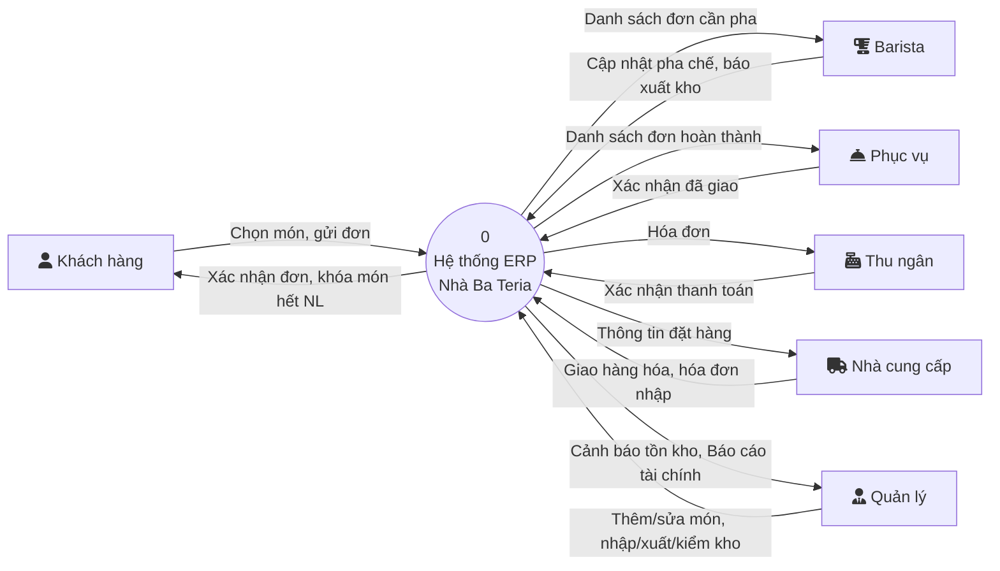
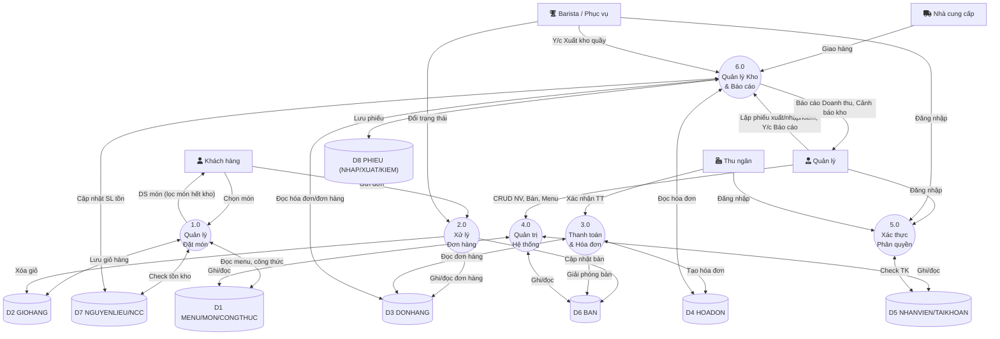
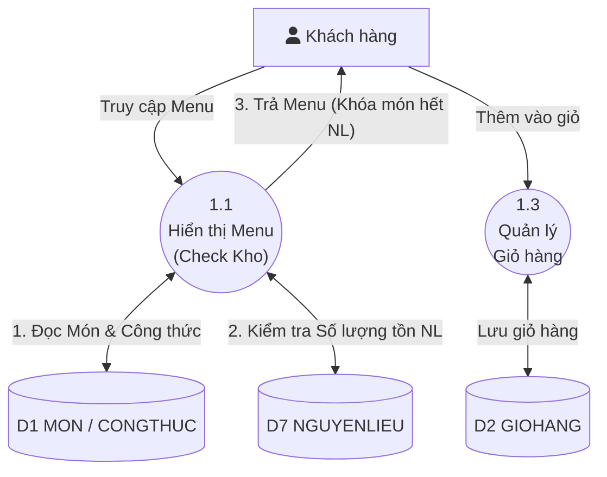
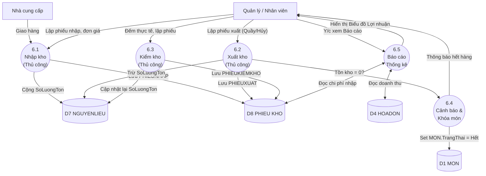

# Sơ đồ Hệ thống Nhà Ba Teria (Phiên bản Cuối kỳ)

> **Tài liệu phân tích thiết kế** — Hệ thống POS & ERP thu nhỏ quán cafe Nhà Ba Teria  
> Phiên bản: 2.0 (Bổ sung Quản lý Kho thủ công, Công thức, Báo cáo thống kê)

---

## 1. Sơ đồ DFD Mức 0 (Context Diagram)

Sơ đồ ngữ cảnh thể hiện tổng quan hệ thống tương tác với các tác nhân bên ngoài. Trong phiên bản này, Quản lý và Nhân viên được bổ sung luồng tương tác với kho hàng và nhà cung cấp.

---

## 2. Sơ đồ DFD Mức 1

Hệ thống được phân rã thành 6 tiến trình chính, bổ sung thêm tiến trình Quản lý Kho & Báo cáo thống kê.

---

## 3. Sơ đồ DFD Mức 2

### 3.1. Phân rã tiến trình 1.0 — Quản lý Đặt món (Cập nhật check tồn kho)

### 3.2. Phân rã tiến trình 6.0 — Quản lý Kho & Báo cáo

Đây là tiến trình mới hoàn toàn, quản lý các nghiệp vụ Nhập/Xuất kho thủ công và xuất báo cáo.

