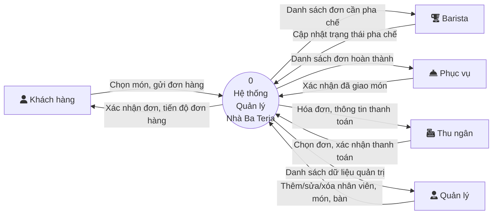
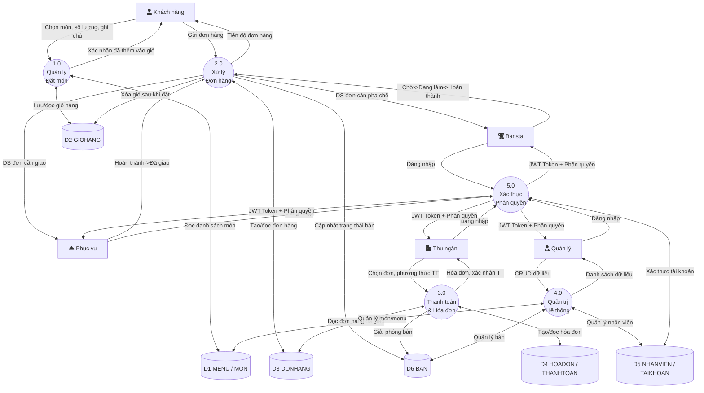
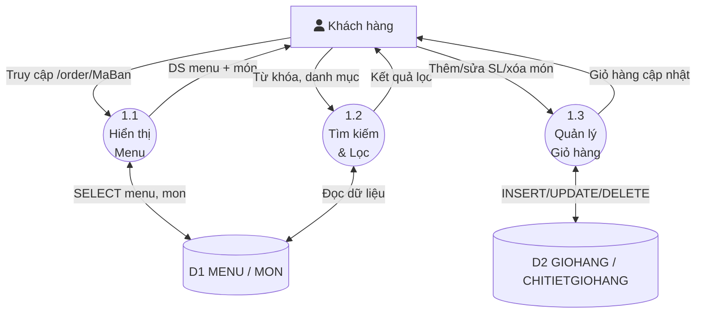
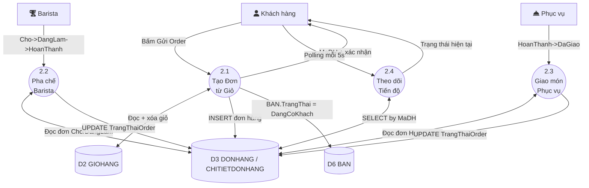
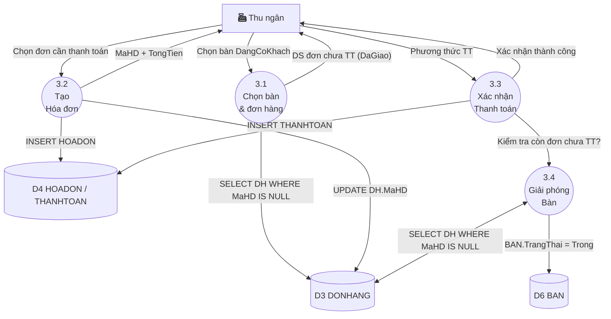
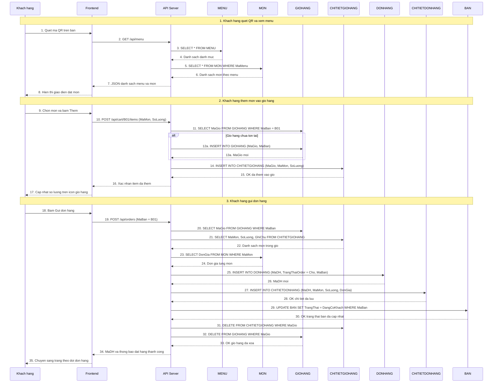
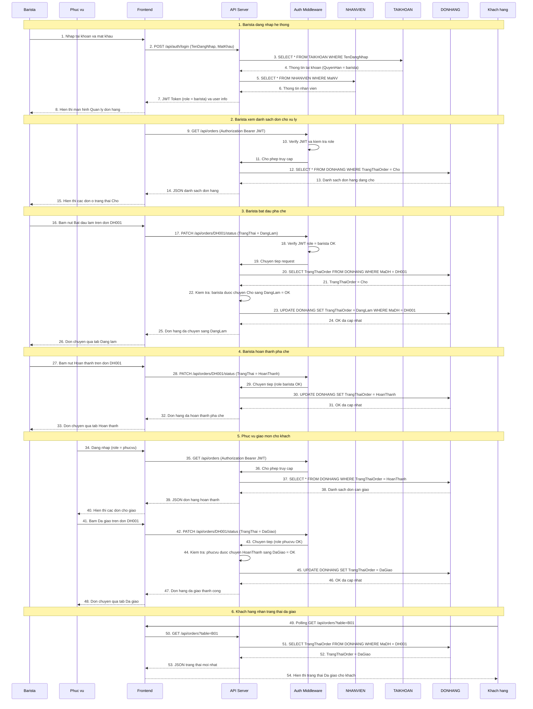
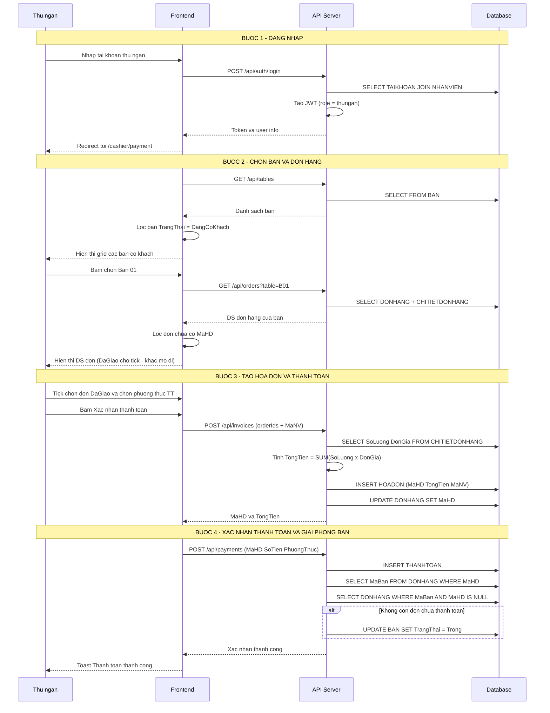
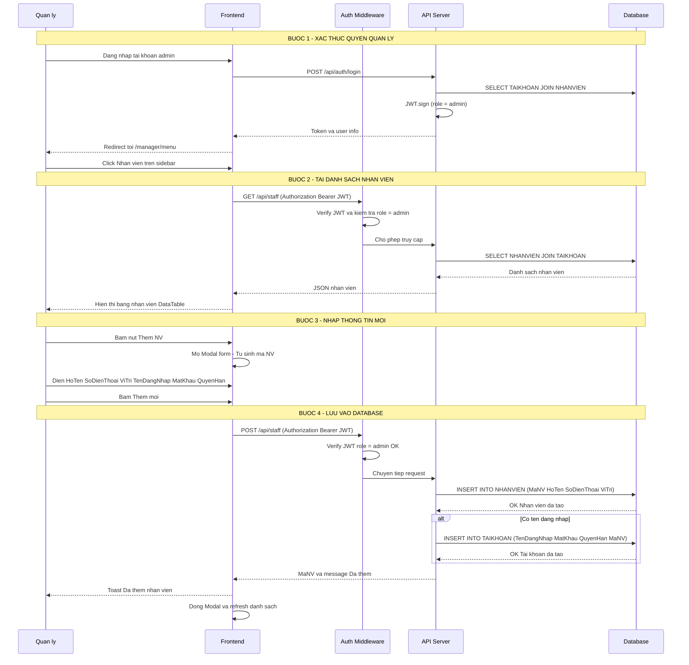
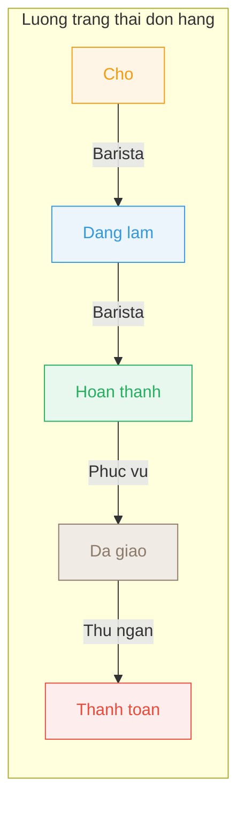

# Sơ đồ Hệ thống Nhà Ba Teria

> **Tài liệu phân tích thiết kế** — Hệ thống quản lý quán cafe Nhà Ba Teria  
> Ngày tạo: 16/05/2026 | Phiên bản: 1.0

---

## 1. Sơ đồ DFD Mức 0 (Context Diagram)

Sơ đồ ngữ cảnh thể hiện tổng quan hệ thống với 4 tác nhân bên ngoài tương tác.

### Mô tả tác nhân

| Tác nhân | Vai trò | Phương thức truy cập |
|----------|---------|---------------------|
| **Khách hàng** | Quét QR, xem menu, đặt món, theo dõi đơn | Mobile (không cần đăng nhập) |
| **Barista** | Nhận đơn, pha chế, báo hoàn thành | Mobile (đăng nhập `barista`) |
| **Phục vụ** | Nhận món đã pha, giao cho khách | Mobile (đăng nhập `phucvu`) |
| **Thu ngân** | Thanh toán, xuất hóa đơn | Desktop (đăng nhập `thungan`) |
| **Quản lý** | CRUD nhân viên, menu, bàn; truy cập toàn bộ | Desktop (đăng nhập `admin`) |

---

## 2. Sơ đồ DFD Mức 1

Phân rã hệ thống thành 5 tiến trình chính.

### Mô tả tiến trình

| Mã | Tiến trình | Chức năng chính |
|----|-----------|----------------|
| 1.0 | Quản lý Đặt món | Hiển thị menu, tìm kiếm, thêm/sửa/xóa giỏ hàng |
| 2.0 | Xử lý Đơn hàng | Tạo đơn từ giỏ, chuyển trạng thái theo phân quyền |
| 3.0 | Thanh toán & Hóa đơn | Tạo hóa đơn, xác nhận thanh toán, giải phóng bàn |
| 4.0 | Quản trị Hệ thống | CRUD nhân viên, menu, bàn |
| 5.0 | Xác thực & Phân quyền | Đăng nhập JWT, kiểm tra quyền hạn |

---

## 3. Sơ đồ DFD Mức 2

### 3.1. Phân rã tiến trình 1.0 — Quản lý Đặt món

### 3.2. Phân rã tiến trình 2.0 — Xử lý Đơn hàng

### 3.3. Phân rã tiến trình 3.0 — Thanh toán & Hóa đơn

## 4. Sequence Diagram — Luồng Gọi Món

> **Kịch bản:** Khách hàng quét mã QR trên bàn, xem menu, thêm món vào giỏ hàng và gửi đơn hàng.

**Giải thích:**

| Bước | Mô tả |
|:----:|-------|
| 1-8 | Khách quét QR, hệ thống truy vấn bảng `MENU` và `MON` để hiển thị thực đơn |
| 9-17 | Khách thêm món, hệ thống tạo `GIOHANG` (nếu chưa có) rồi INSERT vào `CHITIETGIOHANG` |
| 18-35 | Khách gửi đơn → tạo `DONHANG` + `CHITIETDONHANG`, cập nhật `BAN`, xóa giỏ hàng |

---

## 4b. Sequence Diagram — Luồng Xử Lý Đơn Hàng

> **Kịch bản:** Barista nhận đơn và pha chế, Phục vụ giao món cho khách. Khách theo dõi trạng thái đơn hàng theo thời gian thực.

**Giải thích:**

| Bước | Mô tả |
|:----:|-------|
| 1-8 | Barista đăng nhập → truy vấn `TAIKHOAN` và `NHANVIEN` → nhận JWT Token |
| 9-15 | Hệ thống lọc `DONHANG` theo trạng thái `Chờ` để hiển thị |
| 16-26 | Barista chuyển đơn từ `Chờ` → `Đang làm` (validate quyền qua Middleware) |
| 27-33 | Barista chuyển đơn từ `Đang làm` → `Hoàn thành` |
| 34-48 | Phục vụ đăng nhập, lọc đơn `Hoàn thành`, chuyển sang `Đã giao` |
| 49-54 | Khách hàng polling để nhận trạng thái mới nhất từ `DONHANG` |

---

## 5. Sequence Diagram — Luồng Thanh Toán

---

## 6. Sequence Diagram — Luồng Thêm Nhân Viên

---

## 7. Ma trận Phân quyền

| Vai trò | Chờ -> Đang làm | Đang làm -> Hoàn thành | Hoàn thành -> Đã giao | Thanh toán |
|---------|:-:|:-:|:-:|:-:|
| **Barista** | ✅ | ✅ | ❌ | ❌ |
| **Phục vụ** | ❌ | ❌ | ✅ | ❌ |
| **Thu ngân** | ❌ | ❌ | ❌ | ✅ |
| **Quản lý** | ✅ | ✅ | ✅ | ✅ |

---

## 8. Kho dữ liệu (Data Store)

| Mã | Tên | Bảng CSDL | Mô tả |
|----|-----|-----------|-------|
| D1 | Menu và Món | MENU, MON | Danh mục thực đơn và các món |
| D2 | Giỏ hàng | GIOHANG, CHITIETGIOHANG | Giỏ hàng tạm gắn với từng bàn |
| D3 | Đơn hàng | DONHANG, CHITIETDONHANG | Đơn hàng chính thức và chi tiết |
| D4 | Hóa đơn | HOADON, THANHTOAN | Hóa đơn và giao dịch thanh toán |
| D5 | Nhân viên | NHANVIEN, TAIKHOAN | Thông tin NV và tài khoản |
| D6 | Bàn | BAN | Danh sách bàn và trạng thái |
